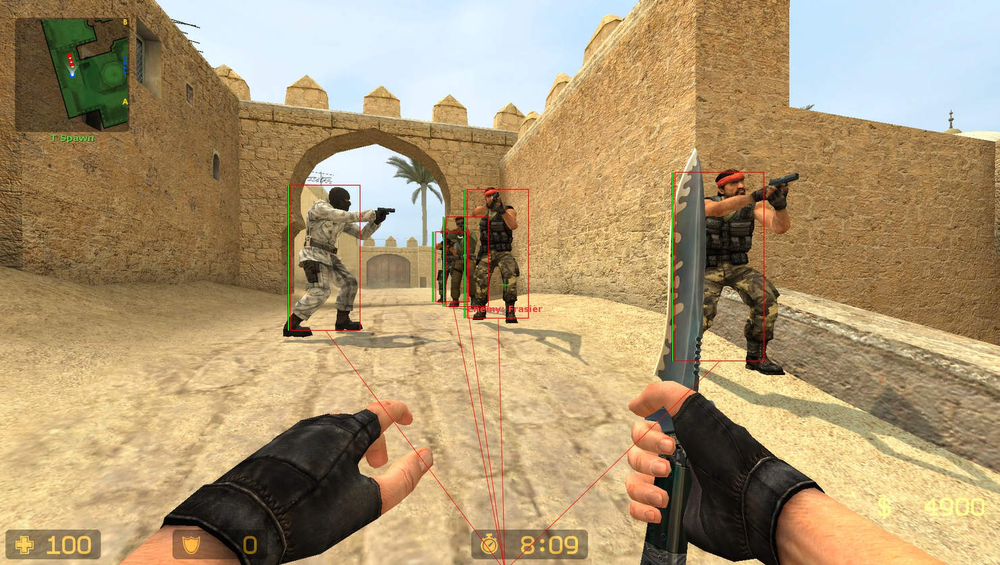

# Educational ESP for CS:S (v93)

A simple, modular external ESP implementation for Counter-Strike: Source v93, designed for educational purposes. This project demonstrates basic concepts of memory reading, world-to-screen projection, and overlay rendering using DirectX 9 and ImGui.

---

## 📸 Preview

---

## 📘 How it Works: Theoretical Background

This project is an **External** cheat. Unlike "Internal" cheats that inject a DLL into the game process, an External cheat runs as a separate standalone application (`.exe`).

### 1. Memory Interfacing (RPM)
The cheat interacts with the game using the Windows API function `ReadProcessMemory`.
- **Process Attachment**: We use `CreateToolhelp32Snapshot` to find the process ID (PID) of `hl2.exe` and then `OpenProcess` to get a handle with `PROCESS_ALL_ACCESS` rights.
- **Module Discovery**: Since game data is stored within specific libraries (`client.dll` for player data, `engine.dll` for the view matrix), we find their base addresses in memory to use as starting points.

### 2. Data Structure & Offsets
Game data is organized in structures. We use **Offsets** to find specific variables relative to a base address:
- `LocalPlayer`: The starting address of your own character's data.
- `EntityList`: An array containing pointers to every other player in the server.
- `Health`, `Origin` (Position), `Team`: Specific variables within each player's data structure.

### 3. World-to-Screen (W2S) Projection
The game world is 3D (X, Y, Z), but your monitor is 2D (X, Y). To draw a box around a player, we must project their 3D position onto your 2D screen.
- **View Matrix**: A 4x4 matrix provided by the game engine that contains the camera's current position, rotation, and field of view.
- **Transformation**: By multiplying a 3D coordinate by the View Matrix, we get "Normalized Device Coordinates" (NDC), which we then scale to your window's resolution.

### 4. Overlay Rendering
To display information without flickering or "drawing over" the game in a way that windows might fight over, we create a **Transparent Overlay**:
- We create a window with `WS_EX_LAYERED` and `WS_EX_TRANSPARENT` styles, making it invisible to mouse clicks and allowing the game to show through.
- We use **DirectX 9** to render high-performance graphics on this transparent layer.
- **ImGui** provides the user interface (menu) and drawing primitives (lines, boxes).

---

## 🛠️ Core Components Breakdown

### `Core::Memory`
The "engine" of the cheat. It handles the low-level Windows API calls.
- `Attach()`: Connects the cheat to the game.
- `Read<T>()`: A template function that reads any type of data from the game's memory.
- `GetModuleBase()`: Finds where `client.dll` or `engine.dll` are loaded.

### `Game::Entity`
An abstraction layer. Instead of manually adding offsets every time, this class provides a clean interface:
- `GetHealth()`: Returns the player's current health.
- `GetPosition()`: Returns the 3D coordinates (Vector3).
- `IsValid()`: A helper to check if a player is actually alive and in the game.

### `Overlay::Window`
Manages the visual part of the cheat.
- `Create()`: Sets up the D3D9 device and the transparent window.
- `ToggleInput()`: Switches the window between "Click-through" (when playing) and "Interactive" (when the menu is open).

### `Utils::Math`
Contains the `WorldToScreen` logic. This is the most mathematically intensive part of the project, handling the projection from 3D space to 2D pixels.

---

## 🛠️ Development Environment
- **IDE**: This project is configured specifically for **VS Code**.
- **No SLN File**: There is no permanent `.sln` file in the root directory. This is intentional. The project uses a **CMake** workflow. 
  - *Note: If you need an `.sln`, it will be automatically generated in the `build/` folder after running CMake or the `build.bat` script.*

---

## 🚀 How to Build
The project uses CMake for build management.

### Prerequisites:
- Visual Studio 2022 (with C++ Desktop Development)
- CMake

### Build Steps:
1. Run `build.bat`. It will automatically configure and compile.
2. The output executable will be in `build/Release/`.

## 🎮 Usage
- **INSERT**: Toggle the menu and mouse input.
- **END**: Close the application.

*Disclaimer: This project is for educational purposes only. It is intended to show how software interacts with other processes at a memory level.*
